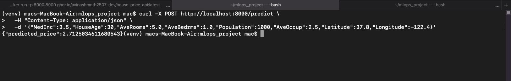

# 🏠 MLOps House Price Predictor

[](https://github.com/avinashmnth2507-dev/mlops-house-price-predictor/actions/workflows/ci-cd.yml)
[](https://github.com/avinashmnth2507-dev/mlops-house-price-predictor/pkgs/container/house-price-api)
[](https://www.python.org/)
[](LICENSE)

**Production‑ready MLOps pipeline** – trains a house price model, serves predictions via REST API, containerises with Docker, orchestrates with Kubernetes, and automates everything with GitHub Actions CI/CD.

---

## 🚀 Features (completed)

- ✅ Data versioning with **DVC** (California Housing dataset)
- ✅ Model training with **MLflow** + **Optuna** hyperparameter tuning
- ✅ **FastAPI** prediction endpoint (`/predict`, `/health`)
- ✅ Dockerised service (Python 3.12)
- ✅ **GitHub Actions** CI/CD: test → build → push to GHCR
- ✅ **Kubernetes** deployment (Minikube) with 2 replicas, health probes, port‑forward
- ✅ Public container image on GitHub Container Registry

---
## 🖼️ Demo

### API Prediction


### MLflow Experiment Tracking


### GitHub Actions CI/CD


### Docker Container


### Kubernetes Deployment


### Published Container Image

## 📦 Quick Start

### 1. Clone the repository

```bash
git clone https://github.com/avinashmnth2507-dev/mlops-house-price-predictor.git
cd mlops-house-price-predictor
